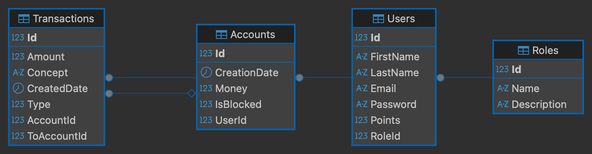

# HU-07 - Diagrama ER y Optimización

## 1. Modelo de datos

El modelo tiene cuatro entidades principales: Roles, Users, Accounts y Transactions.

Cada usuario pertenece a un rol y tiene una única cuenta. Una cuenta puede tener muchas transacciones. En las transacciones se almacena tanto la cuenta de origen como, cuando corresponde, la cuenta de destino.

Las relaciones fueron definidas con Entity Framework Core mediante Fluent API y el diagrama fue generado desde la base SQL Server resultante.

### Relaciones

- Role 1:N User: un rol puede estar asociado a varios usuarios y cada usuario pertenece a un único rol.
- User 1:1 Account: cada usuario tiene una única cuenta.
- Account 1:N Transaction: una cuenta puede tener múltiples transacciones.
- Transaction puede referenciar una cuenta de origen mediante AccountId y una cuenta de destino opcional mediante ToAccountId.

## 2. Diagrama ER



## 3. Índices y optimización

### IX_Users_Email

Facilita las búsquedas de usuarios por email, una operación frecuente para identificar usuarios sin tener que recorrer toda la tabla.

### IX_Accounts_UserId

Facilita la búsqueda de una cuenta a partir de su usuario. Además, es un índice UNIQUE, lo que ayuda a garantizar la relación 1:1 entre User y Account.

### IX_Transactions_CreatedDate

Optimiza consultas del historial de transacciones que filtran u ordenan los movimientos por fecha.

### IX_Users_RoleId

Facilita las consultas y relaciones entre Users y Roles mediante su clave foránea.

### IX_Transactions_AccountId

Facilita la búsqueda de las transacciones asociadas a una cuenta de origen.

### IX_Transactions_ToAccountId

Facilita las consultas de transacciones en las que una cuenta aparece como cuenta de destino.

## 4. Consultas LINQ y SQL generado por EF Core

Para verificar cómo Entity Framework Core traduce las consultas LINQ a SQL Server, se utilizaron cuatro consultas representativas de operaciones de DigitalArs. El SQL fue obtenido mediante el método `ToQueryString()` de Entity Framework Core.

### Consulta 1: Buscar usuario por email

Esta consulta representa la búsqueda de un usuario a partir de su dirección de email.

**LINQ**

```csharp
var query1 = context.Users
    .Where(u => u.Email == "juan.perez@digitalars.com");
```

**SQL generado por EF Core**

```sql
SELECT [u].[Id], [u].[Email], [u].[FirstName], [u].[LastName],
       [u].[Password], [u].[Points], [u].[RoleId]
FROM [Users] AS [u]
WHERE [u].[Email] = N'juan.perez@digitalars.com'
```

Esta consulta se beneficia del índice `IX_Users_Email`, ya que la búsqueda se realiza directamente sobre la columna Email.

### Consulta 2: Obtener la cuenta de un usuario

Esta consulta permite obtener la cuenta asociada a un usuario.

**LINQ**

```csharp
var query2 = context.Accounts
    .Where(a => a.UserId == 2);
```

**SQL generado por EF Core**

```sql
SELECT [a].[Id], [a].[CreationDate], [a].[IsBlocked],
       [a].[Money], [a].[UserId]
FROM [Accounts] AS [a]
WHERE [a].[UserId] = 2
```

Esta consulta se beneficia del índice único `IX_Accounts_UserId`, que además ayuda a garantizar que cada usuario tenga una única cuenta.

### Consulta 3: Obtener transacciones de una cuenta ordenadas por fecha

Esta consulta obtiene las transacciones correspondientes a una cuenta y muestra primero las más recientes.

**LINQ**

```csharp
var query3 = context.Transactions
    .Where(t => t.AccountId == 2)
    .OrderByDescending(t => t.CreatedDate);
```

**SQL generado por EF Core**

```sql
SELECT [t].[Id], [t].[AccountId], [t].[Amount], [t].[Concept],
       [t].[CreatedDate], [t].[ToAccountId], [t].[Type]
FROM [Transactions] AS [t]
WHERE [t].[AccountId] = 2
ORDER BY [t].[CreatedDate] DESC
```

El índice `IX_Transactions_AccountId` facilita la búsqueda de las transacciones pertenecientes a una cuenta.

### Consulta 4: Filtrar transacciones por rango de fechas

Esta consulta representa la búsqueda de movimientos realizados dentro de un período determinado.

**LINQ**

```csharp
var startDate = new DateTime(2026, 1, 1);
var endDate = new DateTime(2026, 12, 31);

var query4 = context.Transactions
    .Where(t => t.CreatedDate >= startDate &&
                t.CreatedDate <= endDate);
```

**SQL generado por EF Core**

```sql
DECLARE @startDate datetime2 = '2026-01-01T00:00:00.0000000';
DECLARE @endDate datetime2 = '2026-12-31T00:00:00.0000000';

SELECT [t].[Id], [t].[AccountId], [t].[Amount], [t].[Concept],
       [t].[CreatedDate], [t].[ToAccountId], [t].[Type]
FROM [Transactions] AS [t]
WHERE [t].[CreatedDate] >= @startDate
  AND [t].[CreatedDate] <= @endDate
```

Esta consulta se beneficia del índice `IX_Transactions_CreatedDate`, especialmente para búsquedas de movimientos dentro de un rango temporal.

## 5. Conclusiones de optimización

El modelo de datos de DigitalArs mantiene relaciones claras entre Roles, Users, Accounts y Transactions, utilizando claves foráneas para mantener la integridad de los datos.

Los índices definidos acompañan operaciones frecuentes de la aplicación, como la búsqueda de usuarios por email, la obtención de una cuenta a partir de su usuario y la consulta de transacciones por cuenta o fecha.

Los campos monetarios `Money` y `Amount` utilizan `decimal(18,2)`, permitiendo representar importes con precisión decimal.

Las relaciones utilizan `DeleteBehavior.Restrict`, evitando eliminaciones en cascada que podrían provocar la pérdida accidental de información relacionada.

Las consultas analizadas muestran que Entity Framework Core traduce correctamente las expresiones LINQ a consultas SQL compatibles con SQL Server y permiten relacionar las decisiones de indexación con operaciones concretas de la aplicación.

Como posibles mejoras futuras, el rendimiento de las consultas podrá volver a evaluarse cuando la aplicación maneje un volumen mayor de datos. En ese contexto se podrán analizar planes de ejecución, tiempos de respuesta y la necesidad de índices adicionales o compuestos según los patrones reales de uso.
